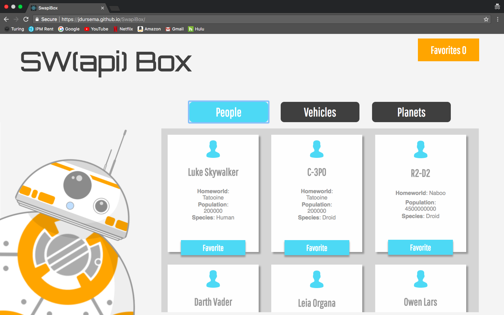
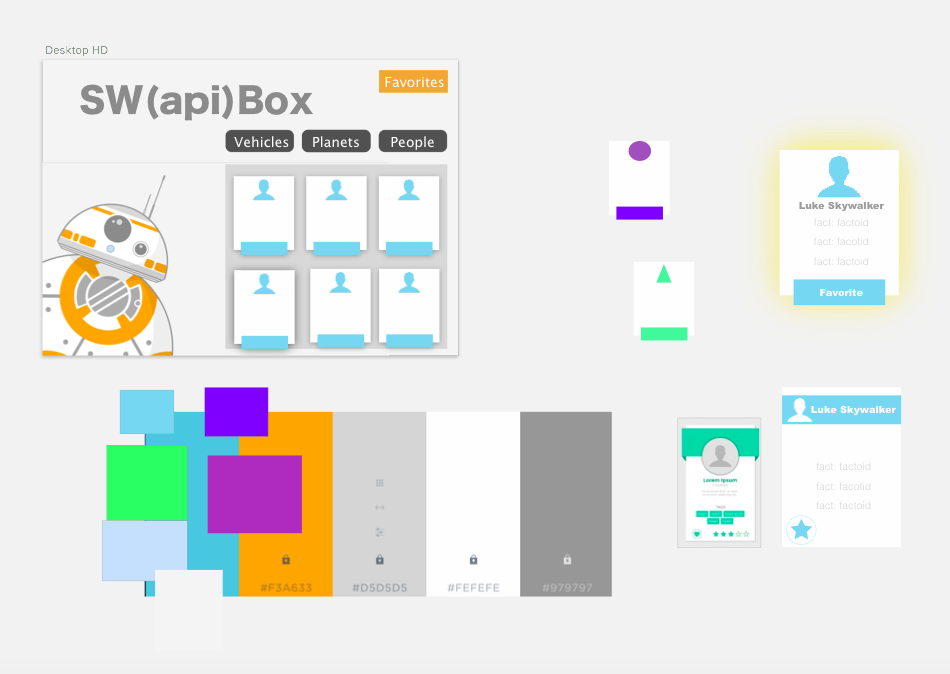

[Check Out the Live Site](https://jdursema.github.io/SwapiBox/)

Swapi Box displays the characters, vehicles, and planets from the Star Wars franchaise. Users can click on different cards to favorite them and view their favorites later.

Swapi box was a 7 day individual project that allowed me, as a Turing student, to work on nesting fetchs. I used the Star Wars API to get data about people, places, and vehicles as well as the opening crawl. I used async and await from ES7 for all the fetches.

##Wireframe (built using Sketch)

